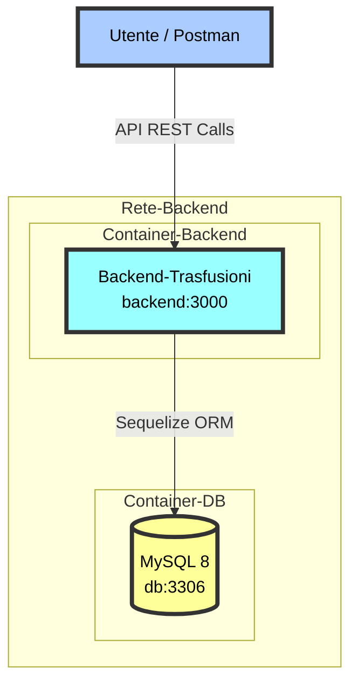
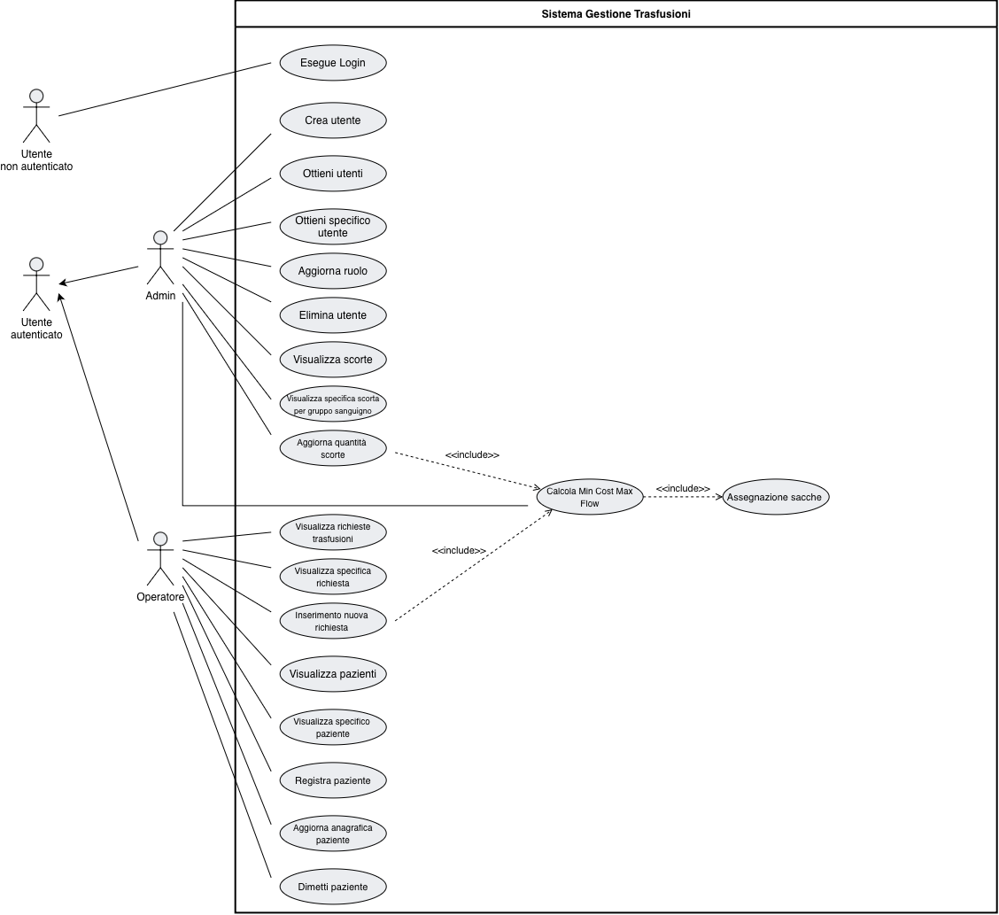
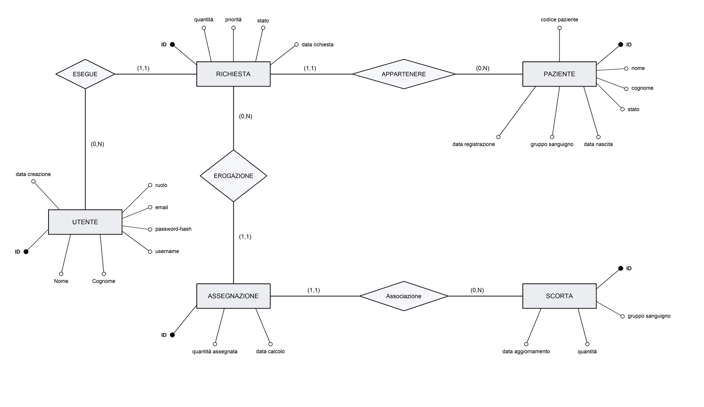
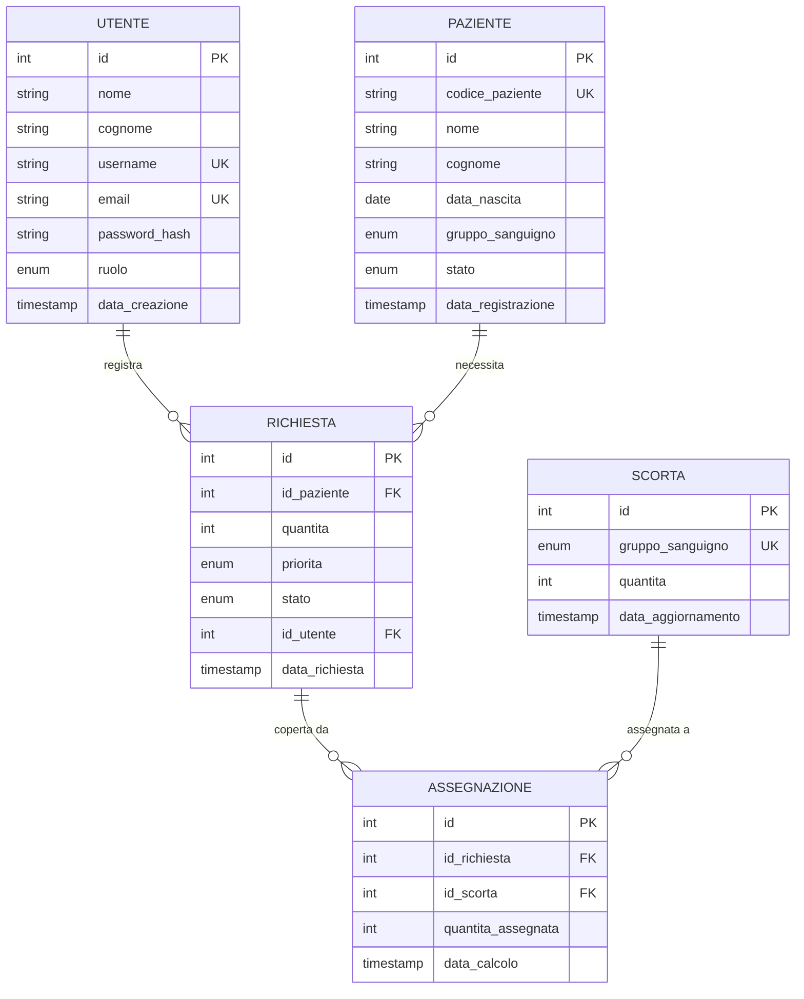

# Progetto Programmazione Avanzata A.A. 25/26 - Gestione Trasfusioni

<div align="center">
    <h2>🩸 Sistema di Gestione Trasfusioni Ospedaliere</h2>
</div>

<p align="left">
  
  
  
  
  
  
  
  
  
  
  
</p>

# Indice

- [📌 Obiettivo](#-obiettivo)
- [🏗️ Progettazione](#️-progettazione)
  - [🖥️ Architettura dei servizi](#️-architettura-dei-servizi)
  - [📊 Diagramma dei casi d'uso](#-diagramma-dei-casi-duso)
  - [🗂️ Diagramma E-R e Schema del Database](#️-diagramma-e-r-e-schema-del-database)
  - [Schema Relazionale](#schema-relazionale-traduzione-logica)

---

## 📌 Obiettivo

Il presente progetto ha come obiettivo quello di sviluppare un sistema di gestione delle trasfusioni di sangue all'interno di una struttura ospedaliera, che permetta di monitorare le scorte ematiche, la registrazione dei pazienti e l'**assegnazione automatica, sicura e matematicamente ottimizzata** delle sacche di sangue. 

Il sistema consente nello specifico:
* **Gestione degli Utenti e dei Ruoli**: Distinzione tra due tipologie di utenti (`admin` e `operatore`), con permessi differenziati gestiti tramite autenticazione basata su JWT e chiavi RSA (RS256).
* **Gestione dei Pazienti e Richieste**: Registrazione pazienti con gruppo sanguigno e gestione delle richieste di trasfusione (con priorità "urgente" o "normale").
* **Gestione delle Scorte Ematiche**: Monitoraggio della disponibilità delle sacche di sangue.
* **Assegnazione Algoritmica**: Assegnazione automatica del sangue ai pazienti tramite algoritmo di Teoria dei Grafi, rispettando le priorità cliniche (urgenze) e le regole di compatibilità sanguigna, preservando il sangue universale (Gruppo 0) dove possibile.

L’intera applicazione backend è containerizzata tramite **Docker** e sviluppata in **TypeScript** ed **Express.js**.

---

## 🏗️ Progettazione

### 🖥️ Architettura dei servizi



L'ambiente backend prevede l'orchestrazione tramite `docker-compose` di due container principali. La logica applicativa è racchiusa interamente nel container Node.js, che implementa un'architettura **monolitica modulare**, isolando nettamente i livelli di Routing, Middleware (autenticazione, autorizzazione, validazione), Controller, Repository/Service e DAO.

L'architettura del progetto si riflette sulle directory, che sono organizzate come segue: 

```
```

### 📊 Diagramma dei casi d'uso

Il diagramma dei casi d'uso (UML Use Case Diagram) illustra le interazioni degli attori principali (**Admin** e **Operatore**) e dell'attore generale (**Utente**) con i diversi casi d'uso racchiusi all'interno del confine del sistema trasfusionale.

<div align="center">
  
</div>

#### Attori e Funzionalità Principali

1. **Utente non autenticato**
   - **Esegue Login**: Consente a chiunque di autenticarsi fornendo le credenziali per ottenere un token JWT e accedere alle risorse protette in base al proprio ruolo.

2. **Utente Autenticato**
   - Funge da base per la propagazione dell'autorizzazione basata sui ruoli.

3. **Admin**
   - **Gestione Profili Utenti**:
     - *Crea utente*: Registrazione di nuove credenziali e associazione di un ruolo specifico (`admin` o `operatore`).
     - *Ottieni utenti* & *Ottieni specifico utente*: Lettura globale o puntuale dei profili registrati.
     - *Aggiorna ruolo*: Modifica dei privilegi di accesso.
     - *Elimina utente*: Rimozione di un profilo.
   - **Gestione Scorte Ematiche**:
     - *Visualizza scorte* & *Visualizza specifica scorta per gruppo sanguigno*: Consultazione delle sacche disponibili in tempo reale.
     - *Aggiorna quantità scorte*: Aggiorna le scorte di magazzino. Questa azione **include** automaticamente il ricalcolo del flusso (`Calcola Min Cost Max Flow`).

4. **Operatore**
   - **Gestione Richieste**:
     - *Visualizza richieste trasfusioni* & *Visualizza specifica richiesta*: Monitoraggio dello stato delle richieste sanitarie, con i dati del paziente associato oppure in forma semplice (solo i dati della richiesta).
     - *Inserimento nuova richiesta*: Registrazione di un nuovo bisogno trasfusionale. Questa azione **include** automaticamente il ricalcolo del flusso (`Calcola Min Cost Max Flow`).
   - **Gestione Pazienti**:
     - *Visualizza pazienti* & *Visualizza specifico paziente*: Ricerca e visualizzazione delle schede cliniche.
     - *Registra paziente*: Inserimento di una nuova scheda anagrafica e del gruppo sanguigno associato.
     - *Aggiorna anagrafica paziente*: Modifica dei dettagli del paziente.
     - *Dimetti paziente*: Dimissione del paziente, gestita tramite soft-delete logico (lo stato passa a `dimesso`) per non perdere lo storico. La dimissione è consentita solo se il paziente non ha richieste pendenti (`in_attesa` o `non_soddisfatta`).

5. **Relazioni di Inclusione Interna (`<<include>>`)**
   - **Calcola Min Cost Max Flow**: Invocato automaticamente da *Aggiorna quantità scorte* e *Inserimento nuova richiesta*. Rappresenta il motore algoritmico del sistema che ricalcola il flusso massimo a costo minimo della rete trasfusionale.
   - **Assegnazione sacche**: Incluso da *Calcola Min Cost Max Flow*. Rappresenta l'associazione fisica delle sacche disponibili ai pazienti.

### 🗂️ Diagramma E-R e Schema del Database

Il RDBMS scelto per la persistenza dei dati è **MySQL**. Di seguito vengono presentati ed analizzati i due livelli di progettazione del database (Concettuale e Fisico).

#### 1. Diagramma Entità-Relazione (ER)
Mostra le entità del dominio, le relazioni logiche (con le molteplicità associate) e gli attributi, focalizzandosi sui requisiti informativi del sistema:

<div align="center">
  
</div>

#### 2. Diagramma Fisico del DB (Stile a Classi)
Mostra l'implementazione fisica delle tabelle nel RDBMS. Qui le associazioni concettuali vengono tradotte in chiavi esterne (`FK`) e vengono definiti i tipi di dato specifici (come `int`, `enum`, `date`):


---

## Schema Relazionale (Traduzione Logica)

Di seguito è riportata la traduzione logica delle tabelle del database (le chiavi primarie sono **sottolineate**, le chiavi esterne sono *in corsivo*):

- **UTENTE** (<u>id</u>, nome, cognome, username, email, password_hash, ruolo, data_creazione)

- **PAZIENTE** (<u>id</u>, codice_paziente, nome, cognome, data_nascita, gruppo_sanguigno, stato, data_registrazione)

- **RICHIESTA** (<u>id</u>, quantita, priorita, stato, data_richiesta, *id_utente*, *id_paziente*)
  - *id_utente* chiave esterna che referenzia UTENTE(id)
  - *id_paziente* chiave esterna che referenzia PAZIENTE(id)

- **SCORTA** (<u>id</u>, gruppo_sanguigno, quantita, data_aggiornamento)

- **ASSEGNAZIONE** (<u>id</u>, quantita_assegnata, data_calcolo, *id_richiesta*, *id_scorta*)
  - *id_richiesta* chiave esterna che referenzia RICHIESTA(id)
  - *id_scorta* chiave esterna che referenzia SCORTA(id)

---


